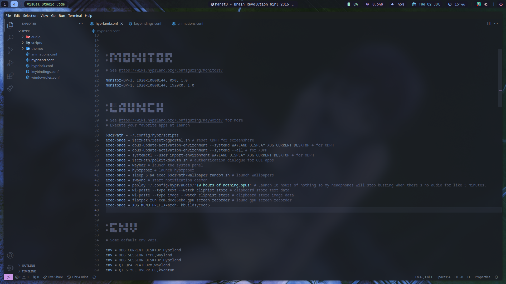
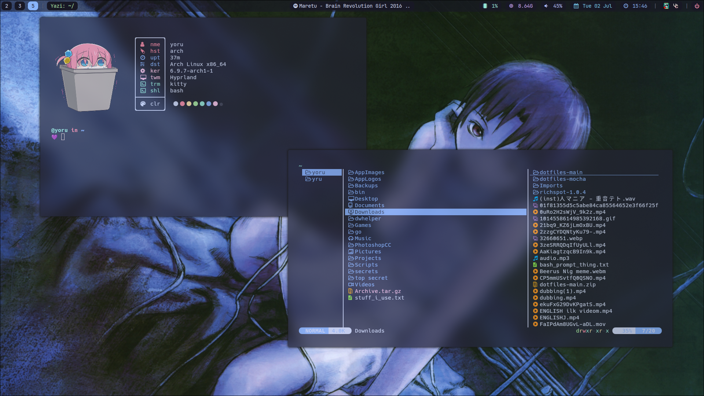

My dotfiles for Arch Linux, Hyprland :)

## 📦 Programs

List of programs and tools I use.

| Component         | Program                                                                                                   |
| ----------------- | --------------------------------------------------------------------------------------------------------- |
| Window Manager 🪟 | [hyprland](https://github.com/hyprwm/Hyprland)                                                            |
| Terminal 🖥️       | [kitty](https://github.com/kovidgoyal/kitty)                                                              |
| Shell 🐚          | [bash](https://www.gnu.org/software/bash/)                                                                |
| Fetch 🖼️          | [catnip](https://github.com/iinsertNameHere/catnip) / [icon](https://www.pixiv.net/en/artworks/102563034) |
| File Manager 📁   | [yazi](https://github.com/sxyazi/yazi)                                                                    |
| Messaging App ⌨️  | [vesktop](https://github.com/Vencord/Vesktop)                                                             |
| Editor 📝         | [vs code](https://code.visualstudio.com/)                                                                 |
| Browser 🌐        | [librewolf](https://librewolf.net/) / [duckduckgo](https://duckduckgo.com/)                               |
| Status Bar 📊     | [waybar](https://github.com/Alexays/Waybar)                                                               |
| App Launcher 🚀   | [rofi](https://github.com/davatorium/rofi)                                                                |
| Lockscreen 🔒     | [hyprlock](https://github.com/hyprwm/hyprlock)                                                            |
| Login Menu 🚪     | [sddm](https://github.com/sddm/sddm)                                                                      |
| Music Player 🎵   | [ncspot](https://github.com/hrkfdn/ncspot)                                                                |

## 🔤 Fonts

A list of fonts that are used in my dotfiles.

`ttf-material-design-icons`, `nerd-fonts`, `Cantarell`, `Hack`

## Hardware

List of hardware I own.

| Hardware | Model                                                                                                            |
| -------- | ---------------------------------------------------------------------------------------------------------------- |
| GPU      | [AMD RX 6600XT](https://www.amd.com/en/products/graphics/desktops/radeon/6000-series/amd-radeon-rx-6600-xt.html) |
| CPU      | [AMD Ryzen 5 5600](https://www.amazon.com/AMD-5600-12-Thread-Unlocked-Processor/dp/B09VCHR1VH)                   |
| RAM      | 2x8 GB                                                                                                           |
| Monitor  | 2xLG monitor, @144hz "27                                                                                         |

## 📝 Credits

-   **Spelljinxer's dotfiles** - Used their dotfiles, tweaked, and added some more stuff on top : [bocchi's minimal theme](https://github.com/Spelljinxer).
-   **waybar theme** - Based waybar on their theme : [hyprlock](https://github.com/brunoanesio/waybar-config)

## 📸 Screenshots

  

  

